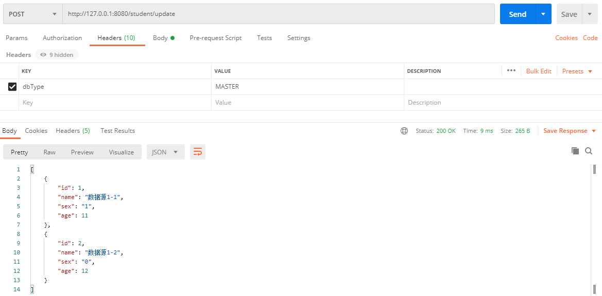
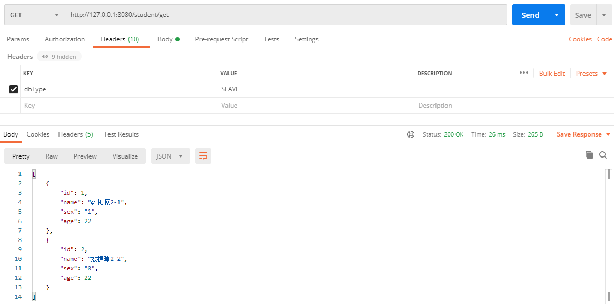

# woodwhales-dynamic-datasource

>   springboot 动态数据源

## 说明

功能实现：根据请求头中携带的`dbType`参数动态切换数据源。

原理：重写 AbstractRoutingDataSource 类的 determineCurrentLookupKey() 方法，并使用 AOP 方式动态切换数据源。

> 本源码依赖了笔者开源的 woodwhales-common 工具包
> 源码下载：https://github.com/woodwhales/woodwhales-common，克隆并打包至本地 maven 仓库才能防止编译报错。

## 实验效果

针对 GET 请求进行拦截并动态切换数据源

针对 POST 请求进行拦截并动态切换数据源

## 参考资料

参考文档：http://www.gxitsky.com/article/1605497337620854

参考源码：https://github.com/gxing19/Spring-Boot-Example/tree/master/spring-boot-datasource

